# <ins>Pro</ins>babilistic <ins>G</ins>rid <ins>R</ins>eliability Analysis with <ins>E</ins>nergy <ins>S</ins>torage <ins>S</ins>ystems (ProGRESS)

Current release version: 1.0.0

Release date: 12/12/2024

## Table of Contents
- [Introduction](#intro)
- [Key Features of ProGRESS](#key-features)
- [Getting Started](#getting-started)
- [Data Requirements](#data) 
- [Workflow Description](#workflow)
- [Contact](#contact)

## Introduction 
<a id="intro"></a>

The Probabilistic Grid Reliability Analysis with Energy Storage Systems (ProGRESS) software tool is a Python-based open-source tool for assessing the resource adequacy of the evolving electric power grid integrated with energy storage systems (ESS). This tool utilizes a Markov Chain Monte Carlo-based stochastic simulation engine to create diverse scenarios that test the limits of the modern power grid consisting of a high volume of ESSs and variable energy resources (VER).  State-of-the-art ESS models are incorporated within the Monte Carlo simulation engine. The charge-discharge dynamics of ESSs, along with their evolving state-of-charge (SOC), are captured by the tool. In addition, ESS failures and repair models are also built into the tool, allowing users to analyze the availability of their ESS devices when they are needed most. ProGRESS also offers the capability of handling the uncertainty associated with VERs, such as, wind and solar power generation resources, enabling the user to simulate thousands of different renewable generation scenarios depending on weather conditions. Users are able to build their own grid models, download and utilize historical VER data using APIs, and analyze magnitude, duration, and frequency of expected future outages. ProGRESS allows users to make informed decisions and plan effectively for VER- and ESS-rich future power systems.

[Back to Top](#top)
## Key Features of ProGRESS
<a id="Key-features"></a>
Key features of ProGRESS include:

- **Emphasis on Energy Storage Systems:** ProGRESS is developed for analyzing the resource adequacy of power systems with a special focus on ESS. This tool offers unique features such as integrating failure and repair models of ESS in resource adequacy evaluation while preserving its charge/discharge dynamics and SOC update characteristics. Future updates to the tool will include sizing of ESS for grid reliability applications, economic analysis of using ESS for these purposes, more detailed ESS reliability models, and other ESS-centric features.

- **Stochastic Monte Carlo Simulation Engine:** At the core of ProGRESS is a Markov Chain Monte Carlo-based engine that allows users to simulate practically unlimited scenarios involving diverse component failures and weather conditions. Each scenario is considered to be a sample of the Monte Carlo simulation and spans 8760 hours (one year). The users can choose as many samples as they want, the choice typically depending on factors such as system size, convergence criteria, and computational resources of the user.

- **Historical VER Data:** ProGRESS allows users to conveniently download weather data using APIs. Data related to solar weather is downloaded by ProGRESS from [NSRDB](https://nsrdb.nrel.gov/) while wind-related weather data is downloaded from [Wind Integration National Dataset Toolkits](https://www.nrel.gov/grid/wind-toolkit.html). ProGRESS then seamlessly converts the weather data to solar and wind power generation data using in-built functions. Users may utilize their own timeseries VRE generation datasets as well. 

- **VER Uncertainty Handling:** Proper handling of the uncertainty associated with VERs is crucial to accurate resource adequacy assessment and ESS sizing for maintaining grid reliability. ProGRESS uses innovative techniques to quantify uncertainty associated with VERs and ensures that these resources are represented appropriately within the simulation. A k-means clustering technique is used to cluster solar power generation while a transition rate matrix method is used for wind power generation.

- **Model Flexibility:** Users can currently represent their power systems using a transportation or a copper-sheet model. The copper-sheet model runs significantly faster, especially for larger systems, while the transportation model generates more accurate results.

- **Modular Structure:** The tool is constructed using an Object-Oriented Programming (OOP) structure and a modular design. This approach enables users to easily modify the backend programs to meet their specific requirements. 

- **User-friendly Graphical User Interface:** The interactive Graphical User Interface (GUI) offered by ProGRESS simplifies the process of input data upload, model building, and results interpretation.

- **Parallel Programming Capabilities:** The backend includes code for parallel programming (using Python's [mpi4py](https://mpi4py.readthedocs.io/en/stable/index.html) library), allowing users with access to high-performance computing resources to run longer simulations with larger systems for more accurate results. Currently, this functionality is not available through the GUI.

[Back to Top](#top)
## Getting started
<a id="getting-started"></a>

### Prerequisites
- Python (>= 3.9, <3.12) installed on your system
- Git installed on your system

### Installing Python
1. Installers can be found at: https://www.python.org/downloads/release/python-3913/
2. Make sure to check the box "Add Python to PATH" at the bottom of the installer prompt.

### Installing Git
- Visit [git-scm.com](https://git-scm.com/) to download Git for your operating system.
- Follow the installation instructions provided on the website.

### Setting Up a Virtual Environment
1. Open Command Prompt on Windows or Terminal on macOS and Linux.
2. Install `virtualenv` (if not already installed):
    ```
    python -m pip install virtualenv
    ```
3. Create a virtual environment:
    ```
    cd <your_path>
    python -m virtualenv <env_name>
    ```
    Replace `<your_path>` with the path to the folder where you want to create the virtual environment.
4. Activate the virtual environment:
   - On Windows:
     ```
     cd <your_path>
     .\<env_name>\Scripts\activate
     ```
   - On macOS/Linux:
     ```
     source <env_name>/bin/activate
     ```
### Installing ProGRESS

1. Clone the Repository:
    ```bash
    git clone https://github.com/sandialabs/snl-progress.git
    ```
  
2. Navigate to the `snl_progress` Directory:
    ```bash
    cd <path_to_snl-progress>
    ```

3. Install Dependencies:
    ```bash
    python -m pip install -r requirements.txt
    
### Solver Installation

Ensure an optimization solver is installed on your machine. Solvers to consider include:

**Open-source Solvers**
- [GLPK](<https://www.gnu.org/software/glpk/>)
- [Clp](<https://github.com/coin-or/Clp>)
- [HiGHs](<https://highs.dev/#top>)
  
**Commercial Solvers**
- [Gurobi](<https://www.gurobi.com/>)
- [Cplex](<https://www.ibm.com/products/ilog-cplex-optimization-studio>)

[Back to Top](#top)

## Data Requirements
<a id="data"></a>

Users must create a `Data` folder inside the `progress` directory with the subfolders `System`, `Solar`, and `Wind` to store system, solar, and wind data, respectively. These subfolders must contain the following data files as shown below:

- README.md
- LICENSE
- progress/
  - Data/
      - System/
          - branch.csv
          - bus.csv
          - gen.csv
          - load.csv
          - storage.csv 
      - Solar/
          - solar_sites.csv
          - solar_data.xlsx (if solar power generation data is user provided)
      - Wind/
          - w_power_curves.csv
          - wind_sites.csv
          - windspeed_data.csv (if wind speed data is user provided)

The file names should be kept exactly the same as shown above. The column names inside each `.csv` file should also be left unchanged. File templates with data from the RTS-GMLC system are provided here: [`Data`](./progress/Data).
A detailed description of the `.csv` files along with the column names is provided as follows:

### System

#### `branch.csv`

| Column       | Description                           |
|--------------|---------------------------------------|
| Branch ID    | Unique branch ID                      |
| From Bus     | From Bus ID                           |
| To Bus       | To Bus ID                             |
| R            | Branch resistance p.u.                |
| X            | Branch reactance p.u.                 |
| B            | Branch line charging susceptance p.u. |
| MTTTR        | Mean Time to Repair                   |
| MTTF         | Mean Time to Failure                  |
| TranOutRate  | Outage rates of transmission lines    |

#### `bus.csv`

| Column       | Description                       |
|--------------|-----------------------------------|
| Bus Name     | Bus/Zone name                     |
| Bus No.      | Numeric bus ID                    |

#### `gen.csv`

| Column       | Description                       |
|--------------|-----------------------------------|
| Gen No.      | Numeric gen ID                    |
| Gen Name     | Generator name                    |
| Bus No.      | Connection bus/zone number        |
| Tech         | Technology Type                   |
| Max Cap      | Maximum capacity of unit          |
| Min Cap      | Minimum capacity of unit         |
| FOR          | Forced Outage Rate                |
| MTTR         | Mean Time to Repair               |
| MTTF         | Mean Time to Failure              |
| Cost         | Cost of generation                |

#### `load.csv`

| Column       | Description                       |
|--------------|-----------------------------------|
| datetime     | mm/dd/yy hh:mm                    |
| day          | mm/dd/yy                          |
| time         | hh:mm:ss                          |
| system_wide  | Total load in the entire system   |
| Bus_1        | Load in bus/zone 1                |
| Bus_2        | Load in bus/zone 2                |
| ...          | Keep adding columns for all buses |

Replace `Bus_1`, `Bus_2`, ... with the bus names from the `bus.csv`.

#### `storage.csv`

| Column       | Description                       |
|--------------|-----------------------------------|
| Name         | Name of storage unit|
| Bus          | Bus/zone to which it is connected|
| Pmax         | Maximum power rating|
| Pmin         | Minimum power rating|
| Duration     | Duration in hours|
| max_SOC      | Maximum allowed state-of-charge (0 to 1)|
| min_SOC      | Minimum allowed state-of-charge (0 to 1)|
| Efficiency   | Efficiency (0 to 1)|
| Discharge Cost| Cost of discharge|
| Charge Cost | Cost of charge|
| Units| No. of subunits in the ESS|
| MTTR         | Mean Time to Repair|
| MTTF         | Mean Time to Failure|

### Solar

#### `solar_sites.csv`

| Column       | Description                       |
|--------------|-----------------------------------|
| site_name| Name of the solar site|
| lat| latitude of the site|
|long| longitude of the site|
|MW| Maximum capacity of the plant in MW|
|tracking| Single/Dual axis tracking (1 or 2)|
|Zone| Bus/zone in which site is located|

### Wind

#### `wind_sites.csv`

| Column       | Description                       |
|--------------|-----------------------------------|
| Farm No.     | Numeric wind farm ID|
| Farm Name| Name of wind farm|
| Zone Name| Name of zone/bus in which wind farm is located|
| Zone No.| No. of zone/bus in which wind farm is located|
| Power Class | Wind power class|
| Latitude| Latitude of the site|
| Longitude| Longitude of the site|
| Hub Height| Height of wind turbines|
| Turbine Rating| Rating of wind turbines in MW|

#### `w_power_curves.csv`

| Column       | Description                       |
|--------------|-----------------------------------|
|Start (m/s)| Starting wind speed for this class in (m/s)|
|End (m/s)| Ending wind speed for this class in (m/s)|
|Class 1| Conversion ratio from speed to power for Class 1|
|Class 2| Conversion ratio from speed to power for Class 2|
| ... | Users can add as many wind classes as they want|

[Back to Top](#top)

## Workflow Description
<a id="workflow"></a>

Simulations in the ProGRESS tool can be executed in three different ways. Users may choose to A) utilize the Graphical User Interface to run simulations, B) use Python scripts to run simulations on their local computer or a remote server, or C) use Python and bash scripts to run simulations by utilizing parallel processing capabilities of a High Performance Computer. The following sections describe each approach in detail.

### A. Instructions for Running Simulations using the Graphical User Interface

Navigate to the directory where ProGRESS is installed and ensure that the virtual environment is activated. Use the following command to launch the tool:

```bash
python -m progress
```

When the application is first launched, users will see the home page:


**Step 1.** After pressing the `Get Started` button, users will be prompted to enter API information. Ensure that you have signed up at the [NREL Developer Network](https://developer.nrel.gov/) beforehand using your details and obtained the required api key. You may skip this step if you plan on using your own data. 

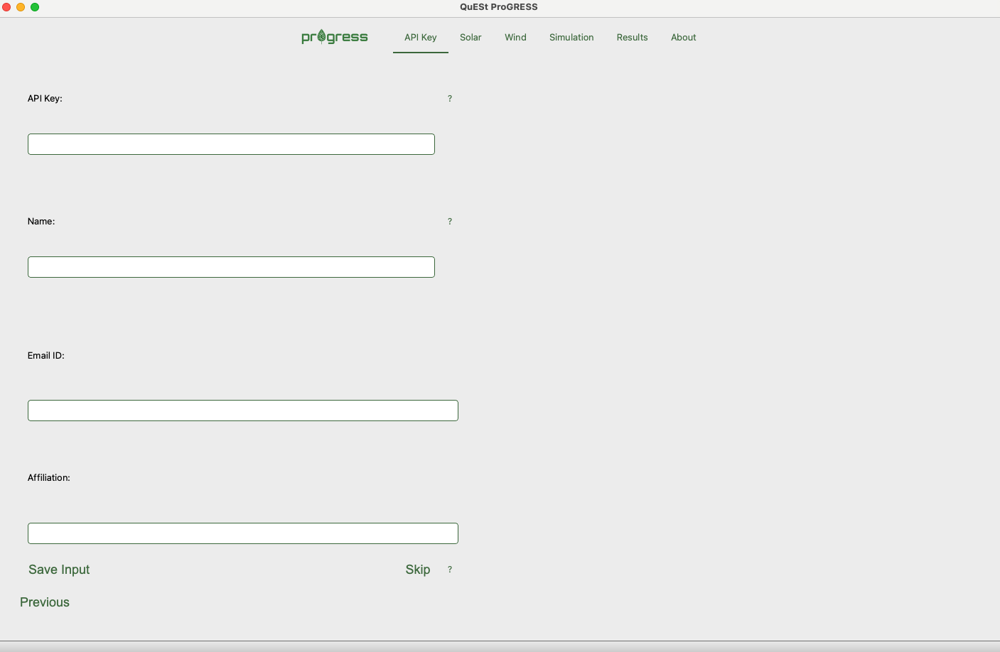

Once the API information is saved, users can move on to the `Solar` tab. 

**Step 2a.** Users may upload their own solar power generation data using the format specified in this [file](./progress/Data/Solar/solar_data.xlsx) or download solar weather data from [NSRDB](https://nsrdb.nrel.gov/) and convert to solar power generation data using the tool. If downloading data, please check for the data availability at the website since the range of years for which data is available is updated periodically. ProGRESS uses [pvlib](https://pvlib-python.readthedocs.io/en/stable/) to convert the downloaded solar weather data to solar power generation data.

|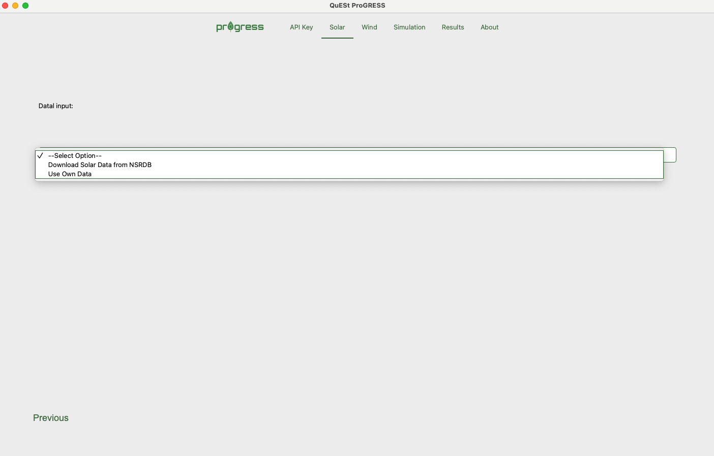 | 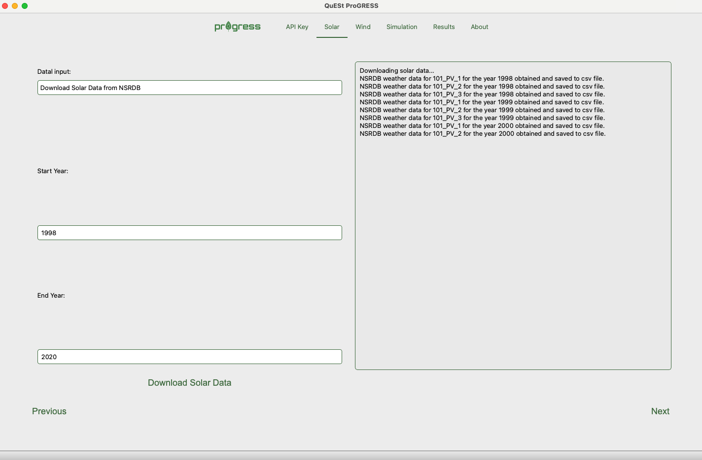 |
|-------------------------|-------------------------|

**Step 2b.** The next step involves clustering the solar power generation data. A k-means clustering algorithm is utilized to cluster the data into days with similar solar power generation patterns and values. These clusters are later utilized by the MCS to randomly select days based on the month of the year. Users are able to choose the optimum number of clusters by evaluating the performance of different cluster values. For example, if the user inputs `10` in the `No. of Clusters to Evaluate` field, the tool will evaluate the performance of clusters starting from `2` to `10`. The SSE and silhouette scores will be displayed on the GUI once the evaluation is complete and can be used to make informed decision on the optimal number of clusters. 

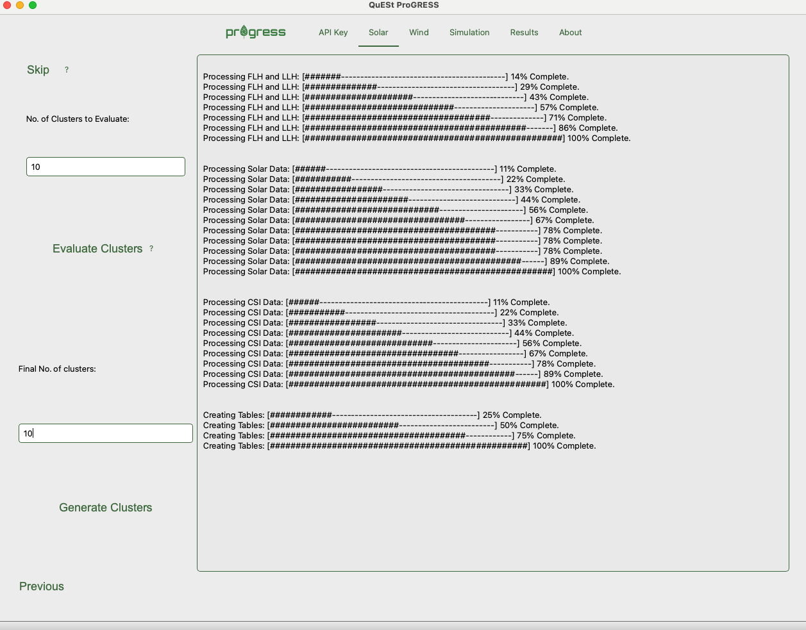

**Step 3.** The next step involves adding wind data. Users may choose to upload their own wind speed data using the format specified in this [file](./progress/Data/Wind/windspeed_data.csv) or download the same from [Wind Integration National Dataset Toolkits](https://www.nrel.gov/grid/wind-toolkit.html). The windspeed data can then be used to generate a transition rate matrix using the `Process Wind Speed Data` button. The transition rate matrix will eventually be used by the MCS to estimate the wind power generation for each hour. 

|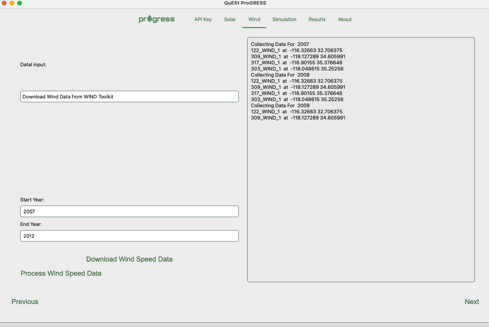| 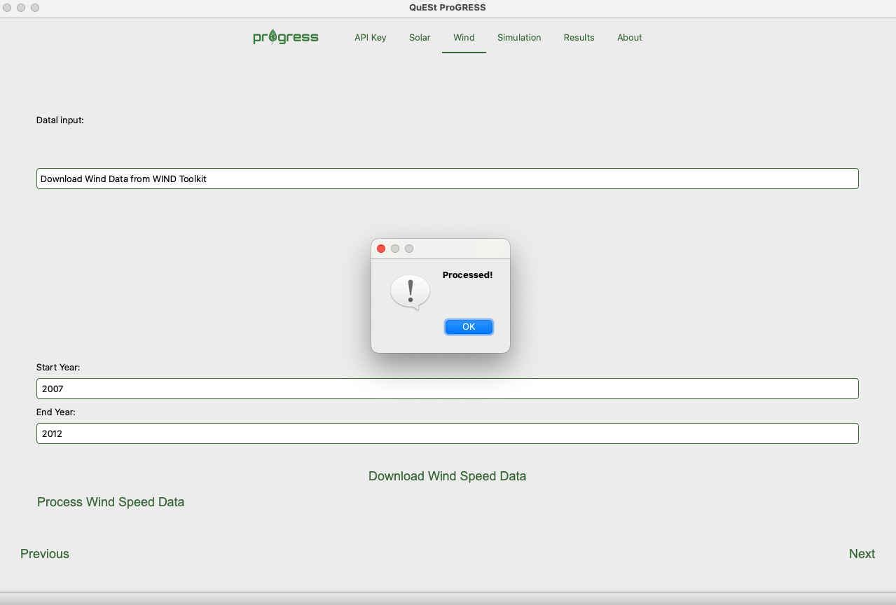|
|-------------------------|-------------------------|

**Step 4.** Once all data has been added, the user can now run the simulation. Guidelines for adjusting the parameters on this page can be found [here](#2step1). Press the `Run Simulation` button once all the information is entered. The simulation progress will be displayed on the right side of the page.  

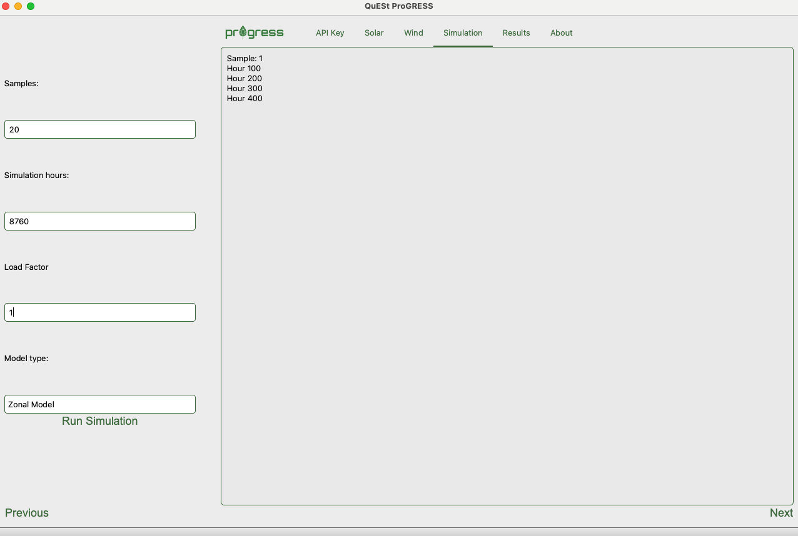

<a id="results"></a>
**Step 5.** Users can view the results within the application once the simulation is complete. 

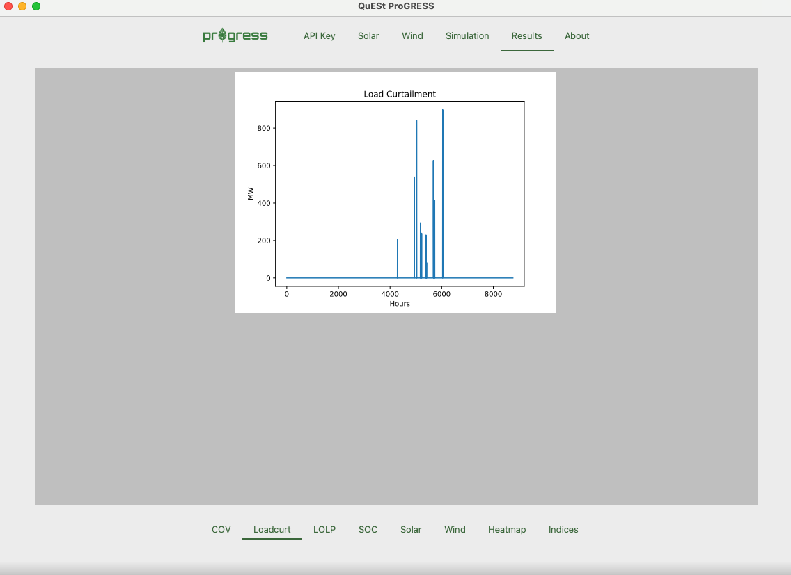

Results include reliability indices, plots of hourly load curtailment, hourly solar and wind power generation, hourly energy storage state-of-charge, heat maps of outages across different months of the year and hours of the day. The results will also be available in the `Results` folder. Some example results are shown below. 

|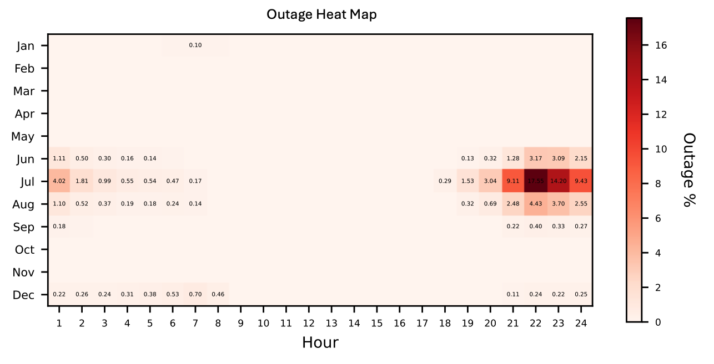 | 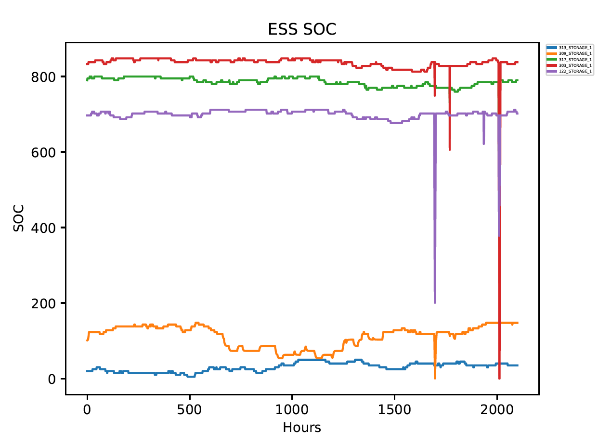 |
|-------------------------|-------------------------|
|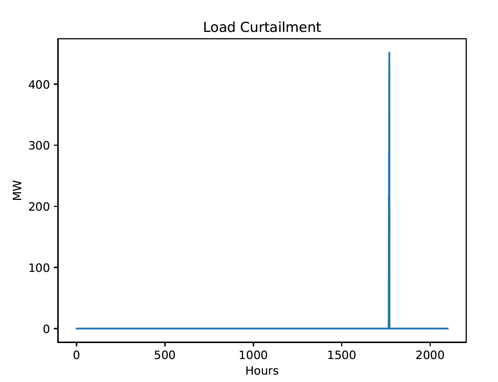 |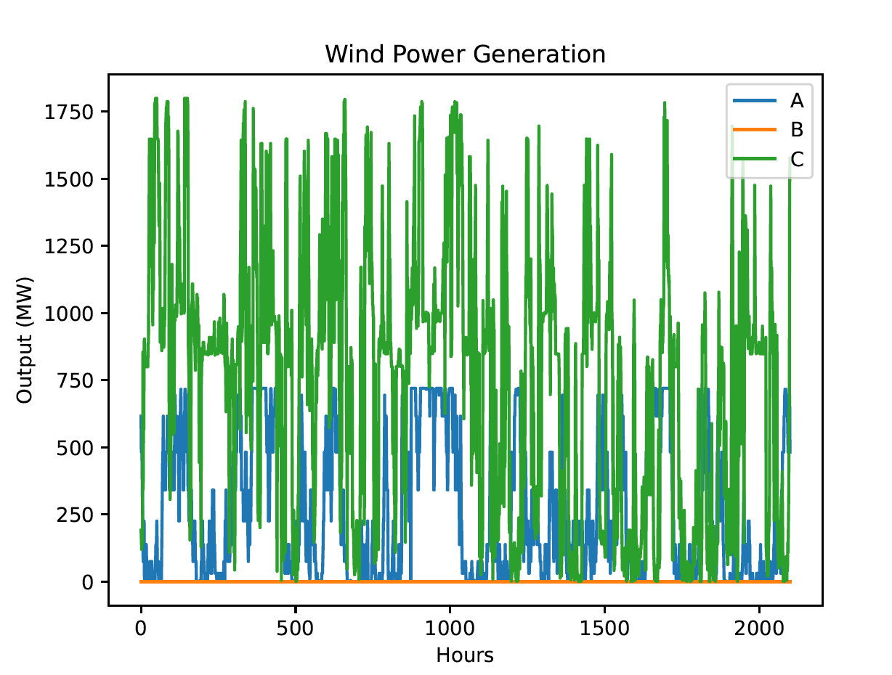|


### B. Instructions for Running Simulations using the Command-Line on Local or Remote Computers/Servers

ProGRESS offers the capability to run simulations through script-based execution without the use of the GUI. These scripts can run on local computers or remote servers. Ensure that you have followed the steps outlined in [Getting Started](#getting-started) for installing the required software and setting up the environment necessary for running the tool. Then navigate to the [progress](./progress) directory and ensure that the virtual environment is activated. 

<a id="2step1"></a>
**Step 1. Configure the Input File:**

Before running the simulation, configure the [input.yaml](progress/input.yaml) file with the specific simulation parameters. Open the file in a text editor and adjust the parameters according to your requirements. The `api_key`, `email`, `affiliation`, and `name` fields are required for downloading weather data from the [NSRDB](https://nsrdb.nrel.gov/) and [Wind Integration National Dataset Toolkits](https://www.nrel.gov/grid/wind-toolkit.html). Ensure that you have signed up at the [NREL Developer Network](https://developer.nrel.gov/) beforehand using your details and obtained the required api key. Also check the data availability at the websites as the range of years for which data is available is updated periodically. Guidance on setting the simulation parameters are provided as follows:

| Parameter      | Comments                   |
|--------------|-----------------------------------|
|`samples`| This is the number of samples that needs to be run for the MCS to converge and depends heavily on the system. Running a small number of samples (e.g., 10-20) might provide a trend of expected outages in the system, although it is recommended that the users run as many samples as required for the MCS to converge for more accurate results. The convergence can be tracked using the Coefficient of Variation (COV) metric plotted in the `COV_track.pdf` file, which can be found in the `Results` folder.|
|`sim_hours`| The recommended number is 8760 hours or one full year for each sample.|
|`load_factor`| Default value is 1. Users may tune this parameter to check how increasing or decreasing the hourly load profile by a constant factor affects system outages.|
|`model`| Users can select a Copper Sheet or a Zonal Model. The Copper Sheet model runs faster but the Zonal Model might be more accurate.|

<a id="2step2"></a>
**Step 2. Download Weather Data:**

Run the [data_download_process.py](./progress/data_download_process.py) file to download the required solar weather and wind speed data using the NREL API. 

```bash
python data_download_process.py
```

Running this file will also process the downloaded weather data and convert them into solar and wind power generation data for each site. Users may skip this step if they want to use their own data or have already downloaded and processed the data during a previous run.

**Step 3. Run Monte Carlo Simlulation**

The final step would be to run the [example_simulation.py](./progress/example_simulation.py) file. 

```bash
python example_simulation.py
```

Running this file executes the MCS for the pre-specified number of samples and generates results that include values of system reliability indices, outage heatmaps, ESS state-of-charge, solar and wind generation plots, and the coefficient of variation. All results will be stored in the [Results](./progress/Results) folder once the simulation is complete. Please refer to [Step 8](#results) of the previous section for more details on results. 

### C. Instructions for Running Simulations on a High Performance Computer (Parallel Computation)

This approach is strongly recommended for users having access to a HPC system and running the tool for analyzing the reliability of large power systems and/or a large number of samples. The example script ([example_simulation_multi_proc.py](./progress/example_simulation_multi_proc.py)) provided with the tool utilizes Python's [mpi4py](https://mpi4py.readthedocs.io/en/stable/index.html) library to implement parallel computation. The computation time would depend on the number of nodes (and the number of cores in each node) that the simulation is run on. 

Ensure that you have followed the steps outlined in [Getting Started](#getting-started) for installing the required software and setting up the environment necessary for running the tool on the HPC server. Then follow [Step 1](#2step1) and [Step 2](2step2) from the previous section to configure the [input.yaml](progress/input.yaml) file and to download the necessary data, respectively. [Step 2]() may be skipped if users want to use their own data or have already downloaded and processed the data during a previous run. There are two main ways of running simulations on a HPC and utilize parallel computation capabilities: a) Using an interactive node, or b) using a bash file to schedule a job.

**a) Using an Interactive Node:**

If using a single interactive node, ensure that you are in the [progress](./progress) directory and execute the following:

```bash
mpiexec -n x python example_simulation_multi_proc.py
```
where `x` is the number of cores (`x < total no. of cores in the node` ) you want to utilize. 

**b) Using a `bash` file for scheduling and running jobs:**

An example `bash` file is provided [here](./progress/example_job.bash). Users can configure this file according to their requirements and typically schedule a job using the following command:

```bash
sbatch example_job.bash
```

The job will run when it reaches the top of the queue. 

[Back to Top](#top)

## Sample Case Study

A test case is included with this tool. The test system is the [IEEE RTS-GMLC](https://ieeexplore.ieee.org/abstract/document/8753693), which is a modernized version of the [IEEE RTS-96](https://ieeexplore.ieee.org/abstract/document/780914). A zonal model of the test system is illustrated as follows:

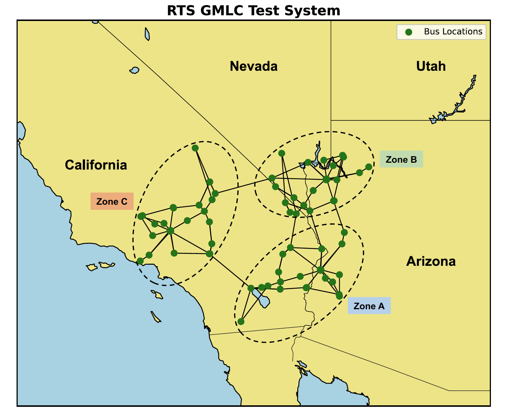 

All test system data provided with the tool has been taken from the [RTS-GMLC GitHub repository](<https://github.com/GridMod/RTS-GMLC>).

## Acknowledgment
<a id="acknowledgement"></a>
The ProGRESS tool is developed and maintained by the [Energy Storage Analytics Group](<https://energy.sandia.gov/programs/energy-storage/analytics/>) at [Sandia National Laboratories](<https://www.sandia.gov/>). This material is based upon work supported by the **U.S. Department of Energy, Office of Electricity (OE), Energy Storage Division**.

**Project team:**
- Atri Bera
- Andres Lopez
- Yung-Jai Pomeroy
- Cody Newlun
- Tu Nguyen
- Dilip Pandit

|  |  |
|-------------------------|-------------------------|
   

[Back to Top](#top)
## Contact
<a id="contact"></a>

For reporting bugs and other issues, please use the "Issues" feature of this repository. For more information regarding the tool and collaboration opportunities, please contact project developer: Atri Bera (`abera@sandia.gov`)
